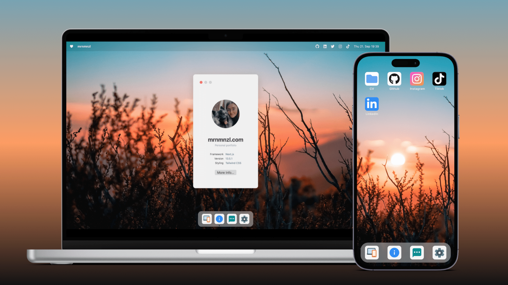

<a href="https://mrnmnzl.com">
  
  <h1 align="center">mrnmnzl.com</h1>
</a>

<p align="center">
  A personal portfolio by Marion Menzl made with Next.js, TailwindCSS and Sanity.io. 
</p>

<p align="center">
  <a href="https://twitter.com/mrnmnzl">
    
  </a>
</p>

## Introduction

The desktop version is heavily inspired by the current macOS system, while the mobile version is styled like the iOS system. The project pages' design is influenced by Notion.

## Local Development

To develop Dub locally, you will need to clone this repository and change the env.js variables in the sanity folder to your own credentials.
Once that's done, you can use the following commands to run the app locally:

```
npm install
npm run dev
npm run build && npm start
```

## Tech Stack

- [Next.js](https://nextjs.org/) – Framework
- [Tailwind](https://tailwindcss.com/) – CSS
- [Sanity.io](https://sanity.io/) – Database
- [Vercel](https://vercel.com/) – Hosting

## Implementation

mrnmnzl.com is built as a standard Next.js 13 application using the new /app router.

[Sanity.io](https://www.sanity.io/) is used as the database for storing metadata and project data.
